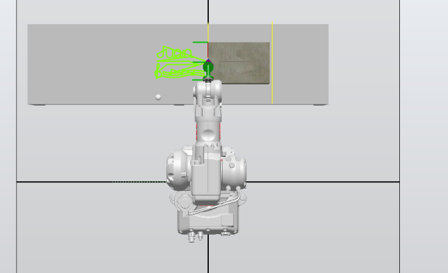
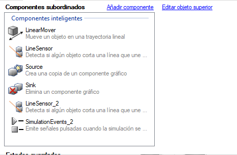

# Laboratorio No. 02: Robótica Industrial – Trayectorias, Entradas y Salidas Digitales.

**Este laboratorio fue desarrollado únicamente por Juan Manuel Rojas Luna, ya que el otro integrante no pudo participar por motivos de salud.**

### Integrante:
Juan Manuel Rojas Luna
*jmrojasl@unal.edu.co*

## Introducción.

La automatización en la industria panadera permite mejorar la eficiencia, precisión y uniformidad en tareas repetitivas como la decoración de tortas. Esta actividad, que tradicionalmente requiere habilidades manuales, puede ser replicada por sistemas robóticos mediante la programación de trayectorias controladas, permitiendo resultados consistentes y personalizados.

En este proyecto se simula la decoración de una torta virtual sobre una superficie rectangular. La tarea consiste en escribir el nombre del único integrante del grupo y añadir una decoración personalizada. A través de herramientas de simulación y planificación de movimiento, se busca generar trayectorias que permitan al robot ejecutar la tarea de forma fluida, precisa y estética, aplicando principios de automatización industrial.

## Planteamiento del problema.

Se plantea el reto de simular la decoración de una torta virtual utilizando un sistema robótico capaz de generar trayectorias. El diseño debe estar adaptado a una torta pensada para 20 personas. El robot deberá partir desde una posición inicial o home, ejecutar un trazo continuo para escribir el nombre del único integrante del grupo (**Juan**) y añadir una decoración personalizada, y finalmente regresar a la posición de origen. Las trayectorias deben desarrollarse dentro de un rango de velocidad comprendido entre 100 y 1000 unidades, con un margen de error máximo tolerado de ±10 unidades en el eje Z. Además, el nombre y decoraciones deben estar claramente separados sobre la superficie rectangular de la torta virtual, respetando tanto las restricciones geométricas como las cinemáticas del sistema.

## Objetivos.

* Reconocer e identificar los componentes principales de un robot industrial.

* Realizar procesos de calibración de herramientas tanto en el robot físico como en el entorno virtual de RobotStudio.

* Comprender y aplicar los distintos tipos de movimientos en el espacio de trabajo de la herramienta, enfocados en tareas de manipulación.

* Profundizar en el uso y manejo de las funciones avanzadas disponibles en RobotStudio.

* Implementar diversas funciones del lenguaje de programación RAPID para el control del robot.

* Utilizar adecuadamente el módulo de entradas y salidas digitales integrado en el controlador IRC5.

## Descripción de la solución planteada.
  
## 1. Diseño de la herramienta detallado.

Para este proyecto se utilizará un robot industrial ABB IRB 140, el cual cuenta con una interfaz mecánica en el extremo del brazo (flanche) cuyas dimensiones se especifican en el manual técnico del fabricante, [página 27](Product_Specification_ABB_IRB_140.pdf). Según el plano proporcionado, el flanche cuenta con cuatro orificios roscados M6 distribuidos cada 90°, a un radio de 20 mm, y un orificio central de referencia de Ø50 H8, lo cual facilita el diseño y alineación de herramientas auxiliares.

La herramienta fue diseñada para acoplarse al flanche del robot ABB IRB 140, siguiendo las dimensiones estándar especificadas en el manual del fabricante. Está compuesta por dos piezas principales que permiten fijar de forma segura un marcador o plumón, facilitando su montaje, alineación y reemplazo si es necesario.

La fabricación se realizó mediante impresión 3D utilizando material PLA, lo cual permitió una construcción rápida. La base de la herramienta contiene los orificios correspondientes a la distribución de tornillos M6 del flanche (separados 90° a un radio de 20 mm), asegurando una fijación estable. La segunda pieza consiste en un cuerpo cilíndrico que actúa como soporte del marcador, con una cavidad interna de Ø18 mm y 20 mm de profundidad para alojarlo de manera vertical. El diseño modular en dos partes facilita el ensamblaje de la herramienta.

Además del diseño funcional, se generaron tres planos técnicos que documentan las partes y el conjunto de la herramienta:

Plano de la base del marcador: contiene las dimensiones del cuerpo superior de la herramienta, incluyendo el alojamiento cilíndrico diseñado para insertar el marcador o plumón. Este componente permite la sujeción estable del instrumento de escritura y garantiza su orientación vertical durante el trazado.

[Plano_Base de la Herramienta](imagenes/Base.pdf)

Plano de la unión entre la base y el flange: detalla la geometría del componente inferior, diseñado específicamente para acoplarse al flanche del robot ABB IRB 140. Incluye la distribución de los orificios para tornillos M6, el diámetro de ajuste y la forma general que asegura la correcta fijación.

[Plano_Unión de la Herramienta](imagenes/Union.pdf)

Plano del ensamble completo: muestra la integración de ambas piezas y su disposición final en relación con el flange del robot. Este plano permite visualizar el montaje total de la herramienta.

[Plano_Ensamble](imagenes/Ensamble.pdf).

La siguiente imagen presenta dos vistas en perspectiva isométrica del modelo CAD de la herramienta diseñada para el robot ABB IRB 140:

Lado izquierdo: se muestra la herramienta ensamblada sin el marcador. 
Lado derecho: se muestra la misma herramienta, ahora con el marcador insertado en la cavidad del soporte cilíndrico.

Durante el desarrollo de la práctica se utilizaron dos herramientas principales, una diseñada y configurada en el entorno virtual de RobotStudio y otra implementada físicamente en la prueba con el robot real.

**Herramienta simulación**

**Herramienta entorno real**

## 1.1 Robotstudio.

Para crear un nuevo proyecto en RobotStudio que incluya tanto el manipulador como el controlador virtual, se deben seguir los siguientes pasos básicos, como se muestra en la imagen proporcionada:

* Abrir RobotStudio y seleccionar la opción “Nuevo” en el panel izquierdo.

* En la sección Proyecto, seleccionar la opción "Proyecto" para crear un nuevo proyecto con controlador virtual.

* Asignar un nombre al proyecto (por defecto, aparece como Project1).

* Seleccionar la ubicación donde se guardará el proyecto.

* Asegurarse de que la casilla “Incluir un Robot y un Controlador virtual” esté activada.

* En la sección Controlador:

* Seleccionar "Crear nuevo" como opción.

* Asignar un nombre al controlador virtual (por ejemplo: IRB140_6_81).

* Verificar o modificar la ruta de almacenamiento del controlador virtual.

* En el apartado Modelo de robot, configurar los siguientes parámetros:

* Modelo de robot: IRB 140

* Variante: IRB 140 6kg 0.81m

* RobotWare: 6.16.00.00

Una vez configurado todo, hacer clic en “Crear” para generar el entorno de simulación con el robot IRB 140 y su controlador asociado.

Ahora, para insertar y posicionar una herramienta diseñada en Inventor en RobotStudio, primero se debe exportar el modelo en formato compatible, preferiblemente .STEP o .SAT. Luego, dentro del proyecto en RobotStudio con el robot ABB IRB 140 ya configurado, se importa el modelo desde la pestaña “Modelado”, opción “Importar modelo CAD”. Una vez importado, el modelo debe ser alineado manualmente con el flanche del robot utilizando las herramientas de traslación y rotación, asegurándose de que el eje de la herramienta coincida con el eje del flanche. Posteriormente, se fija al robot mediante la opción “Montar en”, seleccionando el Tool0. Finalmente, se crea el objeto Tooldata definiendo el punto TCP mediante coordenadas conocidas o usando la función de calibración por tres puntos dentro del entorno de RobotStudio.

Al comparar los Tooldata creados en RobotStudio con los obtenidos en el robot real, pueden observarse diferencias principalmente debido a las condiciones prácticas de montaje y calibración. En RobotStudio, la herramienta se posiciona idealmente sobre el flanche mediante modelos CAD y coordenadas exactas, lo que permite una definición precisa del TCP (Tool Center Point). Sin embargo, en el robot real, el proceso de calibración depende de métodos experimentales (como la técnica de cuatro puntos), y está sujeto a errores humanos, imperfecciones en la fabricación de la herramienta o ligeras variaciones en el montaje. Estas diferencias pueden reflejarse en desplazamientos o rotaciones pequeñas del TCP. Por ello, es importante validar la precisión de los Tooldata reales mediante pruebas de trazado o movimiento sobre una superficie de referencia, y si es necesario, realizar ajustes finos para mejorar la coincidencia con la simulación.

[SAT_Herramienta_RobotStudio_TCP](imagenes/Ensamblaje_Final.sat)

[SAT_Herramienta_Real_TCP](imagenes/Tool_DC_007.sat)

## 2. Workobject.

Para que el robot realice una trayectoria sobre una torta virtual, primero se importa el modelo del objeto desde Autodesk Inventor en formato .SAT utilizando la opción “Importar modelo CAD” en la pestaña Modelado de RobotStudio. Una vez insertado el objeto en el espacio de trabajo, se crea un sistema de coordenadas de trabajo (WorkObject) desde la pestaña Controlador, seleccionando “Crear WorkObject” y definiendo su posición relativa al modelo importado mediante la opción “Establecer por objeto”. Esto permite que todas las trayectorias programadas se realicen en relación con la geometría del objeto, garantizando que el robot trace correctamente sobre su superficie

El WorkObject tiene dimensiones de 20 cm de ancho por 30 cm de largo y una altura de 11.5 cm, representando las proporciones de la torta virtual sobre la cual el robot realiza la trayectoria programada.

[SAT_WorkObjet](imagenes/Ensamblaje_Final.sat)

Con el workobject previamente creado en RobotStudio, se inició la definición de targets que representan las posiciones específicas que el robot debe seguir para trazar el nombre “JUAN” y una figura decorativa personalizada sobre la torta virtual. Cada letra fue descompuesta en varios puntos clave, lo que permitió establecer targets individuales nombrados de forma estructurada (por ejemplo, Target_J_10, Target_J_20, etc.). Posteriormente, estos targets se agruparon en paths independientes (como Path_J, Path_U, etc.), facilitando tanto la edición como la validación de cada rutina de manera modular y ordenada. Esta organización asegura un seguimiento preciso de la trayectoria y simplifica la depuración o ajuste de cada sección del movimiento.

Se crea un Target Home en el que todos los ángulos articulares del robot están configurados en 0 grados, sirviendo como posición de referencia. En la rutina de decoración, este target se utiliza tanto al inicio como al final del proceso, garantizando un movimiento controlado y simétrico desde y hacia la posición inicial del robot.

## 3. Smart Component

En esta etapa del proyecto, se implementa un Smart Component en RobotStudio para simular el proceso automático de decoración de pasteles con una banda transportadora y sensores. Se añaden dos sensores y una banda que actúan en conjunto con la rutina del robot:

 El sistema utiliza dos sensores y una señal digital de control. Cuando se activa la señal digital "cinta", se genera un nuevo pastel en el inicio de la banda (componente Source) y este se mueve por la banda (controlada por LinearMover) hasta que el primer sensor lo detecta. Al ser detectado, se activa una señal digital de entrada, la cual detiene la banda (salida digital) y permite al robot iniciar la rutina de decoración. Una vez completada la decoración, la banda se reactiva y el pastel continúa su recorrido. Finalmente, al llegar al segundo sensor, este activa una lógica que elimina el pastel decorado (componente Sink) y crea uno nuevo, reiniciando el ciclo automáticamente. Este esquema permite validar el proceso de decoración de forma continua, sincronizando correctamente la detección, parada, ejecución de la rutina y recirculación del pastel.

## 4. Diagrama de flujo de acciones del robot.

El siguiente diagrama de flujo ilustra la secuencia de acciones del robot durante la ejecución de la rutina de dibujo.

## 5. Plano de planta de la ubicación de cada uno de los elementos.

A continuación, se presenta una secuencia de imágenes correspondientes a las diferentes etapas del proceso automatizado de decoración de pasteles. Cada imagen muestra el plano de planta con la ubicación de los principales elementos del sistema: banda transportadora, sensores, herramienta de decoración y el pastel.

* Etapa 1: Posición inicial del pastel

En esta etapa, el pastel se encuentra ubicado al inicio de la banda transportadora. La banda está activada y en movimiento, esperando a que el pastel avance hasta la posición del sensor 1. Aún no ha comenzado ningún proceso de decoración.

* Etapa 2: Detección por el sensor 1

  

Cuando el pastel llega a la posición del sensor 1 (SensorSys), este lo detecta y envía una señal al sistema. En respuesta, la banda transportadora se detiene automáticamente para iniciar el proceso de decoración.

* Etapa 3: Decoración finalizada

  
  
Tras una breve pausa de sincronización, se ejecutan las subrutinas de decoración. En esta imagen, se observa al pastel con letras o figuras decorativas aplicadas según la trayectoria programada, utilizando la herramienta montada en el robot.

* Etapa 4: Resultado de la trayectoria programada

  

Aquí se puede observar el resultado final del diseño aplicado al pastel. La herramienta ha seguido una trayectoria previamente definida para formar palabras, figuras o patrones decorativos del producto final.

* Etapa 5: Detección por sensor virtual y reinicio del ciclo

  

En esta última etapa, el pastel decorado llega al final de la banda, donde un sensor virtual lo detecta. Esto activa el mecanismo de retiro del pastel y se introduce automáticamente uno nuevo al inicio del sistema. Se reinicia así el ciclo completo para el siguiente pastel.

## 6. Descripción de las funciones utilizadas.

En esta sección se detallan las funciones implementadas tanto en el entorno del Smart Component de RobotStudio como en el programa RAPID del robot ABB, empleadas para automatizar el proceso de decoración de pasteles.

El Smart Component permite la simulación de sensores, actuadores y mecanismos de control dentro del entorno virtual. En este proyecto, se configuraron los siguientes componentes:

* Source: genera un pastel de forma automática al recibir la señal digital de activación. Representa la entrada del producto en la banda transportadora.

* LinearMover: simula el movimiento lineal del pastel a lo largo de la banda. Se activa cuando el pastel ha sido creado, desplazándolo hacia los sensores.

* LineSensor (Sensor 1): detecta la llegada del pastel a la zona de trabajo del robot. Al activarse, emite una señal digital de entrada (SensorSys) que se utiliza en el programa RAPID para detener la banda y activar el proceso de decoración.

* LineSensor_2 (Sensor 2): ubicado al final de la banda, detecta cuando el pastel decorado ha llegado al extremo. Su activación permite enviar una señal de control para que el pastel sea eliminado y se inicie un nuevo ciclo.

* Sink: componente que elimina el pastel del entorno simulado una vez finalizado el proceso, representando la salida del producto.

* SimulationEvents: gestiona eventos de simulación como el inicio, pausa o reinicio del sistema, permitiendo automatizar y repetir ciclos completos de operación.

El robot ABB es programado mediante el lenguaje RAPID, en el cual se implementaron diversas funciones y rutinas estructuradas de la siguiente manera:

* Declaración de puntos (CONST robtarget): se definen todos los puntos necesarios para realizar las trayectorias de escritura y decoración del pastel. Estos puntos corresponden a las letras "J", "U", "A", "N", así como a curvas y decoraciones adicionales.

* Tooldata y WorkObject: Se define la herramienta utilizada para escribir sobre el pastel (Marcador_45_TCP) y el objeto de trabajo (WO_Pastel), que fija el sistema de coordenadas respecto a la superficie del pastel.

* Subrutinas de trayectoria (Path_J, Path_U, etc.): Cada una de estas subrutinas contiene comandos MoveL (movimiento lineal) y MoveC (movimiento curvo) que trazan las letras y elementos decorativos sobre el pastel, utilizando la herramienta y el objeto de trabajo definidos.

* La función principal main() se encarga de controlar el flujo secuencial del proceso de decoración. Inicialmente, se activa la banda transportadora mediante la salida digital cintaSys, permitiendo el desplazamiento del pastel. El programa permanece a la espera de la señal del sensor 1 (SensorSys), la cual indica que el pastel ha llegado a la zona de trabajo, momento en el que se detiene la banda para posicionar correctamente el producto. Tras una breve pausa de sincronización, se ejecutan las subrutinas correspondientes al trazado de letras y decoraciones sobre la superficie del pastel. Una vez finalizado el proceso de escritura, se reactiva la banda para que el pastel continúe su recorrido hasta el sensor 2, ubicado al final de la línea. Finalmente, se reinicia el ciclo para permitir el procesamiento automático del siguiente pastel.
  
Este esquema de control garantiza la sincronización entre la banda transportadora, los sensores y el robot.

## 7. Código en RAPID del módulo utilizado para el desarrollo de la práctica.

A continuación, se presenta el código fuente implementado en el lenguaje RAPID, correspondiente al módulo utilizado para controlar la rutina automatizada de decoración de pasteles.

[Código_RAPID](imagenes/Module1.mod)

## 8. Vídeo de la simulación en RobotStudio y de la implementación de la práctica con los robots reales.

Se adjunta el vídeo que evidencia el desarrollo completo de la práctica tanto en el entorno de simulación RobotStudio como en la implementación física con el robot real.

[Video](https://youtu.be/PfGwu_JJ1kg)

## 8. Resultados

En esta sección se incluyen las fotografías comparativas que muestran los resultados obtenidos tanto en la simulación desarrollada en RobotStudio como en la implementación real con el robot físico. 

## 9. Conclusiones.

* La práctica permitió validar que los programas desarrollados en RobotStudio pueden ser trasladados con éxito al robot físico, manteniendo la precisión en los movimientos y tiempos de ejecución.

* Se profundizó en el uso del lenguaje RAPID para estructurar rutinas complejas, gestionar entradas y salidas digitales, y coordinar secuencias automatizadas, lo que fortaleció las habilidades de programación en robótica industrial.

* La práctica mostró cómo es posible implementar un ciclo de producción repetitivo de forma automática, respondiendo a estímulos de sensores y accionando elementos como bandas transportadoras, replicando un entorno de manufactura real.

* Se evidenció la relevancia de una correcta calibración del TCP (Tool Center Point) para lograr una decoración precisa del pastel, tanto en el entorno virtual como en el físico.

* El diseño de trayectorias en el espacio de la herramienta permitió afianzar conceptos de cinemática directa, así como entender la influencia de la orientación y el posicionamiento en tareas de manipulación.

* El desarrollo de la práctica requirió una coordinación entre diferentes roles, fomentando el trabajo colaborativo y la toma de decisiones técnicas para resolver problemas durante la implementación.

